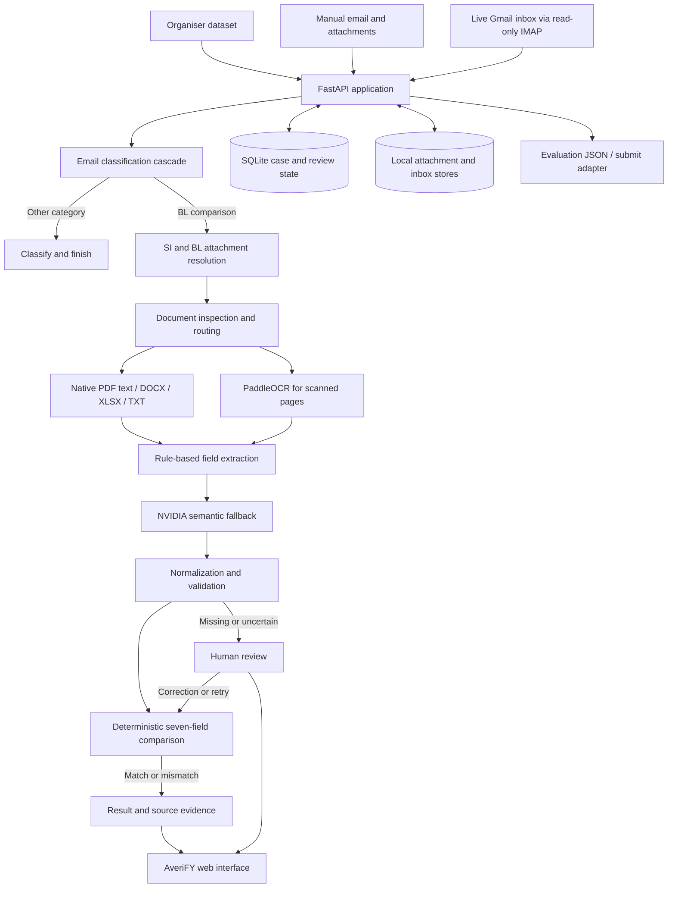

# AveriFY

**Evidence-backed shipping document verification, from inbox to discrepancy report.**

AveriFY helps shipping operations teams identify document-comparison requests,
read Shipping Instruction (SI) and draft Bill of Lading (BL) attachments, compare
the seven required shipment fields, and present a result that a person can verify
against the original source evidence.

Instead of silently guessing when an email or document is unclear, AveriFY sends
the case to a human-review workflow with the relevant email, attachments, missing
fields, evidence and failure reason.

## Submission links

- **Project documentation:** [AveriFY GitHub README](https://github.com/29atly/averis-email#readme)
- **Source code:** [GitHub repository](https://github.com/29atly/averis-email)
- **Live demo:** [AveriFY on Google Cloud](http://136.85.69.184:8000/ui/index.html)

## The problem

Shipping teams receive document checks, new Shipping Instruction requests, invoice
questions, general correspondence and spam in the same inbox. Finding the correct
request is slow, and manually comparing shipment details across two documents is
repetitive and error-prone.

A missed discrepancy can lead to document corrections, shipment delays and extra
operational work. The same field may also use different labels or formatting across
documents—for example, `Port of Loading` and `Load Port`—so direct text matching is
not sufficient.

## What AveriFY does

1. Reads email from the organiser's dataset, manual uploads or a live Gmail inbox.
2. Classifies each message as:
   - Bill of Lading Comparison
   - Shipping Instruction Request
   - Invoice Query
   - General
   - Spam
3. Resolves which attachments are the SI and draft BL.
4. Reads PDF, scanned PDF, DOCX, XLSX and TXT documents.
5. Extracts and normalizes seven shipment fields.
6. Compares the SI and BL deterministically.
7. Shows matches and discrepancies alongside source evidence.
8. Escalates missing, unreadable or uncertain cases for human review.
9. Records corrections, retries and processing activity.

The comparison covers:

- Shipper
- Consignee
- Notify party
- Port of loading
- Port of discharge
- Container count
- Gross weight in kilograms

If every field matches, the result is **No mismatch detected**. Otherwise, only the
fields that differ are highlighted with the SI value, BL value and available source
evidence.

## Technical Architecture



### Main components

| Layer | Implementation | Responsibility |
| --- | --- | --- |
| User interface | HTML, CSS and JavaScript | Inbox, message view, comparison, evidence, human review, activity and Gmail settings |
| API | FastAPI | Case listing, processing, attachment downloads, review, retry, Gmail settings and live events |
| Orchestration | Python pipeline | Runs classification, attachment resolution, ingestion, extraction, validation and comparison defensively |
| Email intelligence | Rules, optional Laya and hosted LLMs | Classifies five email categories and abstains when confidence is inadequate |
| Document processing | PyMuPDF, python-docx, openpyxl and optional PaddleOCR | Routes each attachment and extracts readable text from digital or scanned documents |
| Field extraction | Deterministic rules with NVIDIA fallback | Extracts the seven fields while preserving raw values and source evidence |
| Comparison | Deterministic normalizers | Compares names, ports, container counts and weights without asking a model to decide the final result |
| Persistence | SQLite and protected local file stores | Saves processing results, revisions, corrections, Gmail checkpoints and attachments |
| Live inbox | Python IMAP client and polling worker | Imports new Gmail messages without changing their read state |
| Deployment | Google Cloud VM | Runs the FastAPI API, web interface, Gmail poller and persistent application state together |

## Implementation Details

### 1. Inbox and email classification

The default `cascade` strategy tries deterministic rules first, then local Laya,
then a hosted LLM when earlier stages cannot make a dependable decision. Supported
hosted providers are NVIDIA NIM, Gemini and Hugging Face.

Each classifier returns one of the five allowed categories or an explicit review
outcome. Invalid, empty or ambiguous results are not silently converted into a
confident prediction; the original decision details are retained for reviewers.

### 2. Live Gmail ingestion

A dedicated Gmail inbox can be connected through read-only IMAP using a Google app
password. The background poller checks for new messages every 60 seconds by default,
stores the IMAP UID checkpoint, applies bounded backoff after failures, and imports
messages idempotently.

The first synchronization starts at the current inbox position instead of importing
the complete historical mailbox. Newly received messages appear as pending inbox
items. Server-Sent Events notify the interface when new email is ingested.

### 3. Document routing and OCR

Files are inspected by their contents rather than trusting only their filename
extension. Digital PDFs use their embedded text through PyMuPDF. Scanned or mixed
PDF pages can use PaddleOCR, while DOCX, XLSX and TXT files use dedicated readers.

Unsupported, corrupt, password-protected or unreadable documents produce visible
error or review states. Mixed PDFs preserve native text on readable pages and use
OCR only where needed.

### 4. Field extraction and source traceability

Known field labels are handled with deterministic extraction rules. When a required
field is missing or semantically difficult, the latest extraction stage can ask an
NVIDIA model to inspect only the unresolved fields. Model output is validated against
the expected schema and checked against text that actually exists in the document
before it is accepted.

Each extracted value can retain:

- Original attachment name
- Page number
- Raw source text
- Extracted value
- Normalized comparison value
- Human-correction marker

This evidence is carried through the pipeline and displayed beside the SI and BL
values. AveriFY never fabricates missing source evidence.

### 5. Deterministic comparison

Models help interpret unstructured input, but they do not decide whether two values
match. Normalizers standardize whitespace, capitalization, port suffixes, container
counts and weight units. The comparison stage then checks the normalized SI and BL
values field by field and produces a reproducible discrepancy list.

### 6. Human review

Cases enter review when classification is uncertain, an SI or BL attachment cannot
be identified, a document is unreadable, or a required value is missing. Reviewers
can:

- Confirm the correct email category
- Identify which attachment is the SI and which is the BL
- Correct missing SI and BL values separately
- View and download the original attachments
- Retry the pipeline after the underlying issue is fixed
- Continue the deterministic comparison using the corrected values

Revision numbers prevent stale review submissions from overwriting newer results.

### 7. User interface

The interface is inspired by familiar email applications without copying Gmail
directly. Its modules are separated by task:

- **Inbox:** search, categories, statuses, selection and bulk processing
- **Message:** original email, attachments and automated outcome
- **Comparison:** seven-field SI-versus-BL result
- **Source Evidence:** side-by-side proof for extracted values
- **Human Review:** classification, attachment and missing-value correction
- **Activity:** processing stages, errors, retries and evidence coverage
- **Gmail Inbox Settings:** mailbox connection and synchronization status

Completed cases remain available through Inbox filters, avoiding a duplicate page.

### 8. API and persistence

FastAPI serves both the JSON API and the frontend under `/ui/`. Processing results,
reviews, revisions, timing and activity are saved in SQLite. Manually composed email,
Gmail email and organiser data remain separate sources but are presented through one
case interface.

Important endpoints include:

| Endpoint | Purpose |
| --- | --- |
| `GET /cases` | List and filter inbox cases |
| `GET /cases/{email_id}` | Process or retrieve one complete case |
| `POST /cases` | Compose an email and upload attachments |
| `POST /cases/{email_id}/process` | Process a pending case |
| `POST /cases/{email_id}/review` | Submit a human decision or correction |
| `POST /cases/{email_id}/retry` | Run the pipeline again |
| `GET /emails/{email_id}/attachments/{index}` | Download an original attachment |
| `GET /events` | Receive live inbox updates through Server-Sent Events |
| `/settings/gmail` | Configure, test or remove the Gmail connection |

The organiser's `/submit` format is treated as an evaluation adapter rather than the
application's internal data model.

## Challenges Faced

### Cloud deployment

The application combines an HTTP server, a continuously running Gmail poller,
persistent SQLite state, uploaded files, OCR dependencies and API credentials. This
made free stateless hosting unsuitable: sleeping instances would stop mailbox polling,
and ephemeral filesystems could lose review state and attachments after a restart.

We deployed the complete FastAPI application and frontend together on a Google Cloud
VM. This provides a continuously running server and persistent VM storage without
redesigning the hackathon prototype around a stateless platform. The public demo is
available at [http://136.85.69.184:8000/ui/index.html](http://136.85.69.184:8000/ui/index.html).

The deployment is suitable for demonstrating the end-to-end workflow, but production
hardening remains necessary. The next steps include a domain and HTTPS, login and
authorization, restricted CORS, managed secrets, automated backups, monitoring and
resource limits for expensive document-processing tasks.

### Applying machine learning reliably

The first local model was not fine-tuned for the five hackathon categories, so its
confidence was inconsistent on short or ambiguous shipping emails. Depending on a
single model also made the workflow fragile when a provider was unavailable or
returned malformed output.

We addressed this with a cascade: deterministic rules handle clear cases, Laya can
rank the five intents locally, and hosted models provide a final fallback. Low
confidence or invalid output goes to human review. For document fields, deterministic
rules remain primary and NVIDIA is used only for unresolved semantic cases. The
system validates structured model output and checks its evidence against the source
text before using it.

### Heterogeneous and imperfect documents

Real shipping documents are not consistently formatted. They may contain renamed
extensions, tables, scanned pages, mixed digital-and-image PDFs, different labels,
missing values or multiple plausible weights. A single parser was therefore not
enough. The routing layer separates inspection from extraction and selects native
text, structured readers or OCR page by page.

### Preserving trustworthy evidence

Extracting a value is not useful if an operator cannot confirm where it came from.
Maintaining attachment identity, page numbers and raw text across separately built
pipeline stages required shared schemas and careful API mapping. The interface avoids
simulated evidence and displays null states honestly when the backend cannot provide
proof.

### Integrating parallel team contributions

Classification, ingestion, extraction, comparison and the interface were developed
as separate responsibilities. Shared schemas, exact stage function contracts and a
defensive orchestrator were needed so one stage could fail without crashing the
entire inbox. Automated API, pipeline and frontend tests helped detect contract
changes during integration.

## Future Roadmap

### Near term

- **Login and role-based access:** require authentication and provide separate roles
  for operators, reviewers, administrators and read-only auditors.
- **Deployment hardening:** place the Google Cloud VM behind a domain and HTTPS,
  automate deployments, move credentials into managed secrets, and add backups,
  monitoring and recovery procedures.
- **Machine-learning evaluation:** build a labelled validation set, measure precision,
  recall and confidence calibration for each category, and compare rule, Laya and
  hosted-model performance before choosing thresholds.
- **Model improvement:** fine-tune or adapt a shipping-domain classifier, add more
  representative email examples, and use reviewer corrections as an approved
  feedback dataset rather than automatically training on unverified changes.
- **Security hardening:** restrict CORS, encrypt stored credentials, add session
  expiry, rate limits, upload malware checks and tamper-evident audit records.

### Product expansion

- Replace local SQLite and file storage with a managed relational database and object
  storage for multi-user reliability.
- Move OCR and model inference into an asynchronous job queue so large documents do
  not block API requests.
- Support multiple inboxes and OAuth-based Gmail or Microsoft 365 connections.
- Add document thumbnails and bounding-box highlighting for exact visual evidence.
- Add reviewer assignment, comments, service-level timers and notifications for
  ageing cases.
- Expand comparison rules to additional shipping document types and customer-specific
  fields.
- Add dashboards for classification accuracy, review causes, discrepancy trends,
  processing time and model cost.
- Export signed discrepancy reports and complete audit histories for downstream
  operations.
- Introduce multilingual OCR and extraction for regional shipping documents.
- Add horizontal scaling, centralized logging, health monitoring and disaster-recovery
  testing for production use.

## Run Locally

### Requirements

- Python 3.11 or newer
- Node.js for the frontend test suite
- The organiser's data bundle, or a configured Gmail inbox

### Installation

```bash
git clone https://github.com/29atly/averis-email.git
cd averis-email
python3 -m venv .venv
source .venv/bin/activate
pip install -e .
cp .env.example .env
```

Optional local model and OCR dependencies:

```bash
pip install -e '.[laya]'
pip install -e '.[ocr]'
```

### Configuration

Set the organiser data directory in `.env`:

```dotenv
AVERIS_INBOX_SOURCE="/absolute/path/to/sdoc-hackathon-bundle/data_v2"
EMAIL_CLASSIFIER_MODE=cascade
EMAIL_LLM_PROVIDER=nvidia
NVIDIA_API_KEY="your-key"
NVIDIA_MODEL="your-model-id"
```

The application also supports Gemini and Hugging Face. See `.env.example` for the
complete configuration. Never commit real API keys or Gmail app passwords.

### Start the application

```bash
source .venv/bin/activate
uvicorn averis_email.web:app --reload --port 8000
```

Open:

- Web interface: <http://localhost:8000/ui/>
- Interactive API documentation: <http://localhost:8000/docs>
- Public Google Cloud demo: <http://136.85.69.184:8000/ui/index.html>

The application should currently run with one API worker because the Gmail poller
and local SQLite state are process-local.

### Connect Gmail

Open **Gmail Inbox Settings** in the interface, enter the dedicated mailbox address
and a 16-character Google app password, test the connection, and enable automatic
reading. New messages arriving after activation will be imported; the historical
inbox is not backfilled automatically.

## Classifier Configuration

Available modes:

| Mode | Behaviour |
| --- | --- |
| `cascade` | Rules, then Laya, then the configured hosted LLM |
| `rule_based` | Deterministic rules only |
| `laya` | Local option scoring with confidence thresholds |
| `llm` | Selected hosted provider only |

For detailed classifier configuration, see
[LLM classifier setup](docs/llm-classifier.md) and
[Laya classifier setup](docs/laya-classifier.md).

## Document Extraction Command

The document router can be used independently:

```bash
python -m averis_email.extraction_pipeline "path/to/document.pdf"
python -m averis_email.extraction_pipeline "path/to/document.pdf" --inspect-only
```

See [document routing](docs/document-routing.md) for supported formats, routing
contracts and custom handlers.

## Verification

```bash
.venv/bin/python -m pytest tests/ -q --ignore=tests/read_pdf_examples.py
node --test tests/frontend_api.test.cjs
```

The tests cover classification, document routing, native extraction, OCR adapters,
normalization, comparison, Gmail synchronization, persistence, review flows, API
contracts and frontend data hydration.

## Repository Layout

```text
frontend/                         Browser interface and module scripts
src/averis_email/
  classifier.py                  Classifier selection and cascade
  orchestrator.py                End-to-end pipeline coordination
  schemas.py                     Shared data contracts
  web.py                         FastAPI routes and frontend hosting
  gmail_*.py                     IMAP, MIME parsing, polling and storage
  extraction_pipeline/           File inspection, routing and OCR
  stages/                        Classification through comparison
docs/                             Technical implementation notes
tests/                            Python and frontend integration tests
```

Additional documentation:

- [Frontend and API integration](docs/frontend-api.md)
- [Gmail ingestion](docs/gmail-ingestion-handover.md)
- [Document routing](docs/document-routing.md)
- [Workflow overview](docs/workflow.md)

## Current Scope and Limitations

- A public Google Cloud VM demo is deployed, but it currently uses an IP address and
  HTTP rather than a production domain and HTTPS configuration.
- Authentication and role-based access are not yet implemented.
- Persistence is designed for a single application instance and local disk.
- Gmail ingestion uses app-password IMAP for a dedicated mailbox rather than
  multi-user OAuth.
- OCR and local Laya support require optional dependencies and additional memory.
- Evidence currently uses source text and page metadata; visual bounding boxes are a
  future enhancement.
- The project is a hackathon prototype and requires additional security, scalability
  and privacy work before production use.
